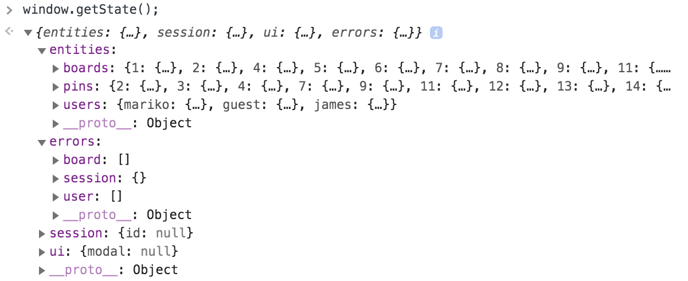

# README

# pinTravel

Welcome to [PinTravel](https://pintravel.herokuapp.com/#/). This is a single-page web application inspired by Pinterest. It allows users to visually share, and discover new travel destination by posting images to their own board and browsing what other users have pinned.

## Technologies
The stack of this application consists of:

    Frontend with React/Redux
    A backend JSON API server with Ruby on Rails, integrated with Postgres for data storage
    JavaScript
    HTML5/CSS/SASS
    PostgreSQL database
    Image storage using AWS S3 and Ruby on Rails Active Storage

## Features

Similar to Pinterest, the application consists of a CRUD functionality of user's boards and pins. 

### Responsive Design Layout
I use CSS Grid and CSS Flexbox to handle the whole presentation of front end layout. The website is designed with mobile-first design approach. It is showing fewer columns on smaller viewport sizes, and more columns as the screen estate allows for more.
<div align="center">
        
</div>

<br>

### User Authentication
User registration, login and logout process are secured using BCrypt password encription and Ruby SecureRandom to generate uniq session token. Furthermore, only logged in user can navigate board and pin create form pages. React router will redirect to login page when user is trying to access protected component rendered pages.

```javascript
def current_user
    return nil unless session[:session_token]
    @current_user ||= User.find_by(session_token: session[:session_token])
end

```

```javascript
def password=(password)
    @password = password
    self.password_digest = BCrypt::Password.create(password)
end

def is_password?(password)
    BCrypt::Password.new(self.password_digest).is_password?(password)
end
```

```javascript
const Auth = ({ component: Component, path, loggedIn, exact }) => (
    <Route path={path} exact={exact} render={(props) => (
        !loggedIn ? (
            <Component {...props} />
        ) : (
            <Redirect to='/' />
            )
    )} />
);

const Protected = ({ component: Component, path, loggedIn, exact }) => (    
    <Route path={path} exact={exact} render={(props) => (
        loggedIn ? (
            <Component {...props} />
        ) : (
            <Redirect to='/' />
            )
    )} />
);

```

### Single Page Web Application
The application is built using ReactJS library with Redux tool to manage local state. It also use React Router to create dynamic, client-side routing, to allow navigation without the page refreshing as the user navigates. React Router uses component structure to call components, which display the appropriate information.

<div align="center">
        
</div>
<div align="center">
Slice of Redux local state
</div>
<br>

### Pin Image Upload Feature Hosted in AWS S3 using Rails Active Storage
Pin images are hosted in Amazon Web Service S3 when user upload the image. With the help of Active Storage, the application can transform image and extract meta-data from arbitrary files and save them in PostgreSQL database.

```ruby
class Pin < ApplicationRecord    
    ...
    has_one_attached :picture
end
```

## Future Enhancement

    Infinite scrolling
    Implement Map
    Implement Progressive Web Application
  

